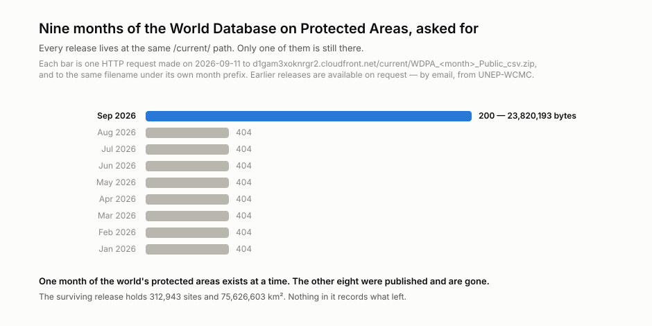
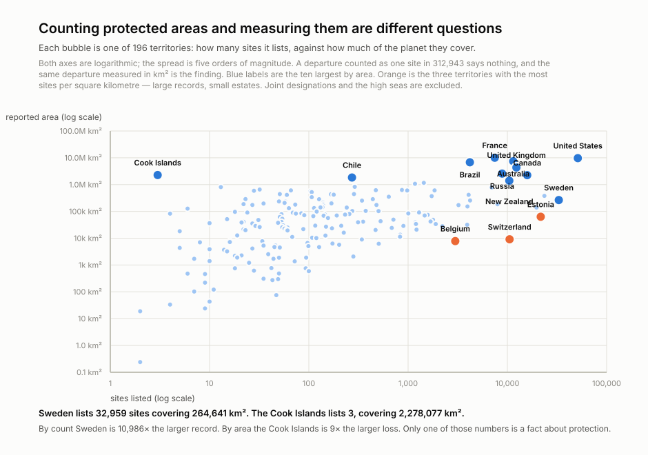
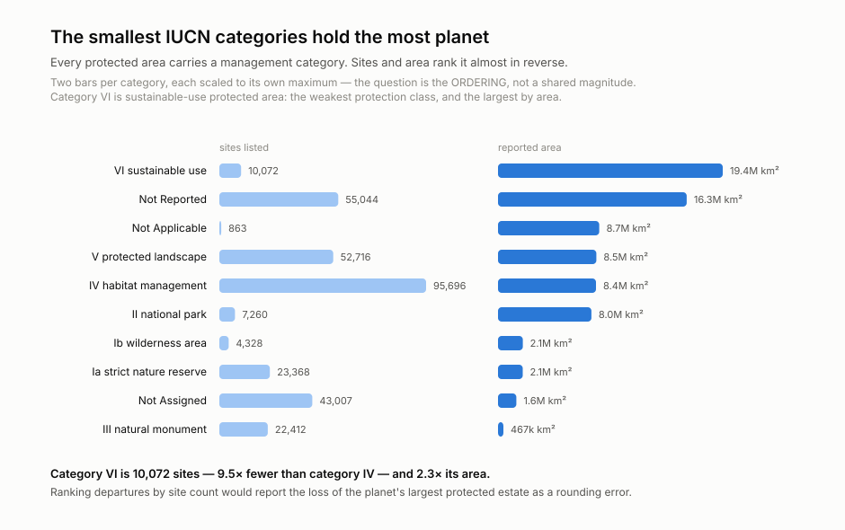
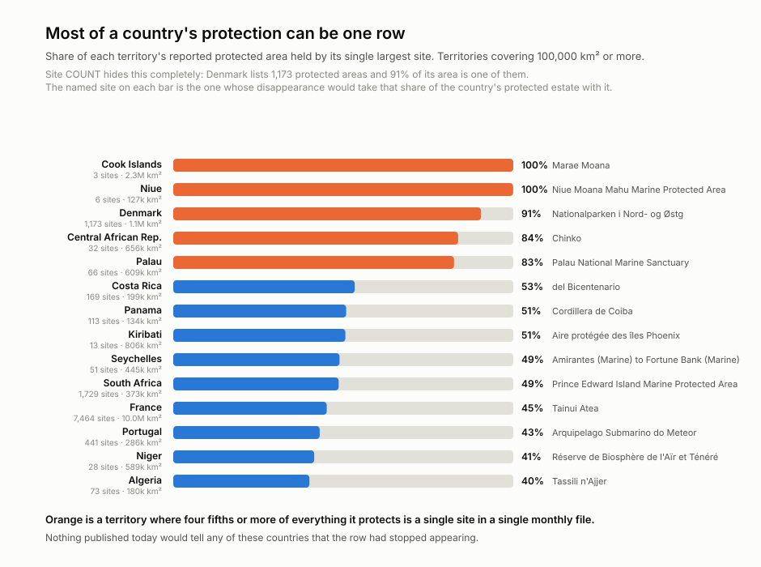
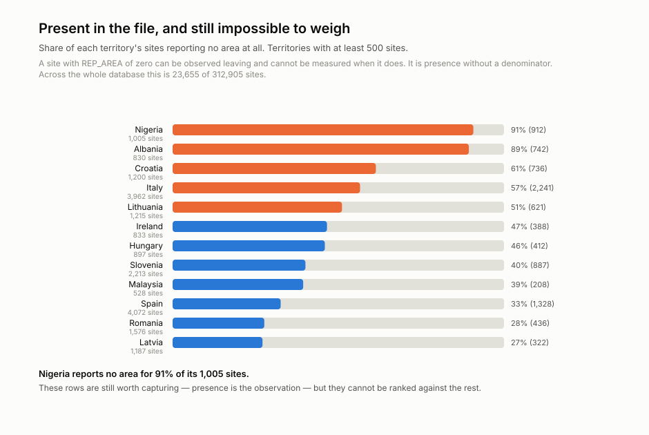

<h1 align="center">wss-protected-areas</h1>

<p align="center">
  <strong>Every protected area on earth, kept because only this month's exist</strong>
</p>

<div align="center">

  <a href="https://github.com/q3dresearch/wss-protected-areas/actions/workflows/capture-monthly.yml"></a>
  <a href="https://github.com/q3dresearch/wss-protected-areas/commits"></a>
  <a href="https://github.com/q3dresearch/wss-protected-areas/blob/main/LICENSE"></a>
  <a href="https://github.com/q3dresearch/wss-protected-areas"></a>

</div>

<p align="center">
  <sub>fleet: <a href="https://github.com/q3dresearch/wss-engine">engine</a> · <a href="https://github.com/q3dresearch/wss-forest-harvest">forest harvest</a> · <a href="https://github.com/q3dresearch/wss-drug-scarcity">drug scarcity</a> · <a href="https://github.com/q3dresearch/wss-healthcare-exclusions">healthcare exclusions</a> · <strong>protected areas</strong></sub>
</p>

**The World Database on Protected Areas is released monthly and exactly one
release is online.** The download path is literally `/current/`.

<p align="center">
  
</p>

Every one of those was fetched twice — once under `/current/` and once under
its own month prefix. Only the current month answers, at either path. Earlier
releases are *available on request*, by email, from UNEP-WCMC.

## There is no way for the WDPA to say a protected area is gone

That is the whole reason this repository exists. Here is the entire `STATUS`
vocabulary of the September 2026 release:

| STATUS | sites |
| --- | --- |
| Designated | 304,978 |
| Established | 6,375 |
| Proposed | 1,270 |
| Inscribed | 276 |
| Adopted | 34 |
| Not Reported | 10 |

No `Degazetted`. No `Removed`, `Revoked` or `Lapsed`. A protected area that is
downgraded, downsized or degazetted does not change status — **it stops
appearing in next month's file**, and with the previous file gone there is
nothing to compare against. Presence is the observation.

[PADDDtracker](https://www.padddtracker.org/) is the existing record of these
events and it is a *larder*, not a listener: its own download button points at
[zenodo.org/records/4974336](https://zenodo.org/records/4974336) — a DOI'd,
versioned, permanently archived research dataset. Fetch it once as a join
control. It cannot tell you what left last month.

## Counting protected areas and measuring them are different questions

<p align="center">
  
</p>

**Sweden lists 32,959 protected areas covering 264,641 km². The Cook Islands
lists 3, covering 2,278,077 km².** By count Sweden is 10,986× the larger
record; by area the Cook Islands is 9× the larger loss. Only one of those is a
fact about protection, which is why `area_listed` carries the weight on the
same row that carries the presence.

The same inversion runs through the management categories:

<p align="center">
  
</p>

Category VI — sustainable use, the weakest protection class — is **10,072
sites holding 19,364,825 km²**, the largest area class in the database from the
third-smallest count. Marine sites are **10,822 of 312,943 (3.5%) and 47.0% of the area**: the
average marine site is 3,287 km² against a terrestrial 133 km², so one marine
departure weighs twenty-five terrestrial ones.

## Most of a country's protection can be one row

<p align="center">
  
</p>

**Denmark lists 1,173 protected areas and 91% of everything it protects is one
of them** — the Northeast Greenland National Park, which the WDPA itself
truncates to `Nationalparken i Nord- og Østg`. The Cook Islands and Niue are at
100%. Site count hides this completely, and `top_site_share` is emitted per
territory from the very first capture so it does not take a year of archive to
see.

**A correction worth recording, because it was nearly published.** `PRNT_ISO3`
holds 222 values and 25 of them are joint designations — `FRA;ITA;MCO`,
`KAZ;TKM;UZB`, 28 sites between them. Counting those as countries made 22 look
like national estates holding exactly one protected area, and produced a chart
saying so. France holds 7,464. Excluding joint codes, **7 real territories hold
five sites or fewer and none holds exactly one.** Every per-territory
measurement here excludes any code containing a semicolon, and `is_territory`
travels on each one so a reader cannot repeat it.

## What the archive cannot fix

<p align="center">
  
</p>

**23,656 sites (7.6%) report `REP_AREA` of zero and 34,459 (11.0%) report no
designation year.** Those rows can be observed leaving and cannot be weighed or
aged when they do. Nigeria reports no area for 91% of its 1,005 sites. This is
a limit of the source and it is counted in the derived table
(`sites_without_area`, `sites_without_year`) rather than hidden.

**The identifier has already renamed itself.** This release keys on `SITE_ID` /
`SITE_PID`; the documented WDPA identifiers for years were `WDPAID` /
`WDPA_PID`, and anything written against the old names silently reads nothing.
The parser accepts both and records which spelling a release used, so the next
rename is dated to the month instead of discovered as an empty capture.

The questions this archive exists to answer, with honest statuses and the
people who act on them, are in
[docs/research-questions.md](docs/research-questions.md).

## Coverage

| source | what it is | cadence | first capture |
| --- | --- | --- | --- |
| `wdpa.protected.areas` | the monthly WDPA public CSV release — 314,766 rows collapsing to 312,943 sites, 75,626,603 km², across 196 territories plus 25 joint designations and the high seas | monthly | 2026-09 |

## The data you get

`derived/observations/<YYYY-MM>.csv.gz` — one row per entity, per metric, per
release month:

```
series_id, entity_id, observed_at, captured_at, metric, value, unit, source_id, raw_ref, parser_version
```

`observed_at` is the **release month, not the fetch time** — the file names its
own month and that is the date the state was true. A re-fetch of the September
release cannot invent an October.

| entity | metrics |
| --- | --- |
| `pa:<SITE_ID>` | `area_listed` (km², and the presence), `country`, `status`, `realm`, `name` |
| `country:<ISO3>` | `sites_listed`, `area_listed`, `is_territory`, `top_site_share`, `top_site` |
| `iucn:<cat>` | `sites_listed`, `area_listed` |
| `feed:wdpa` | `sites_listed`, `rows_listed`, `area_listed_total`, `marine_sites`, `marine_area`, `territories_listed`, `territories_excl_joint`, `joint_designations`, `sites_without_area`, `sites_without_year`, `id_column`, `columns` |

**`name` is not on every row, and that was measured.** Restating a static name
312,943 times a month cost 4.5 MB of an 11.0 MB partition — 41% of the file for
one field that never moves. It is emitted for sites of 100 km² or more, every
site in a territory holding ten or fewer, and every territory's single largest
site: **17,685 sites, 5.7% of the rows and 98.5% of the area at risk.** Nothing
is lost that cannot be recovered — the complete zip is in object storage, so
the derived table is what you scan and the raw is what you investigate.

## Storage

`storage: object`. One capture is 23.8 MB and the zip is already compressed, so
git would carry 286 MB a year and the repository would be unclonable inside
three. There is no smaller endpoint: the Protected Planet API needs a key and
would cost 312,943 requests to cover the same ground.

There is **no personal data**. `MANG_AUTH` names management authorities and
`GOV_TYPE` reaches "Individual landowners" (9,528 sites), but no individual is
named anywhere in the file. Object storage here is a size decision, not a
privacy one.

## Adding a source

1. Add `registry/<source_id>.yml` (copy the existing entry), `status: paused`.
2. Add a parser in `parsers/` if the payload shape is new.
3. `wss doctor <source_id>` — **read the raw response**.
4. Flip to `status: active`, add a Coverage row, commit.

Nothing else. No workflow edits, ever.

## Run it locally

```bash
python -m venv .venv && . .venv/bin/activate
pip install -r requirements.txt
export WSS_CONTACT="https://github.com/q3dresearch/wss-protected-areas"

wss validate
wss doctor wdpa.protected.areas
wss capture --cadence monthly
wss derive --parsers parsers.wdpa_site_v1
python examples/visualize.py
```

Capturing locally needs the R2 variables from `.env.example`, because the
source declares `storage: object`.

## Going live

1. Push this repo **and the engine repo** under the same GitHub owner
   (`q3dresearch`) — the workflows install the engine from
   `github.com/q3dresearch/wss-engine` at the pinned tag.
2. Set the repo secret **`WSS_CONTACT`** — capture refuses to run without it.
3. Set **`R2_ACCOUNT_ID`**, **`R2_ACCESS_KEY_ID`**, **`R2_SECRET_ACCESS_KEY`**,
   **`R2_BUCKET_NAME`** and optionally **`WSS_OBJECT_PREFIX`**. Without them the
   capture job runs and writes nothing, which looks like success until the
   derive finds no raw.
4. Run `capture-monthly` once by hand (Actions → capture-monthly → Run
   workflow), confirm the bot's data commit lands, then let the cron take over.

## Licences

Two separate files, on purpose: code is MIT ([LICENSE](LICENSE)); the derived
observations are CC-BY-4.0 ([LICENSE-DATA](LICENSE-DATA)), citation in
[CITATION.cff](CITATION.cff).

**The WDPA itself is not redistributed here.** Protected Planet's terms allow
free non-commercial use with attribution and do not permit republishing the
database. `raw/` goes to private object storage; what this repository publishes
is aggregate measurement over time, not a copy. See
[protectedplanet.net/en/legal](https://www.protectedplanet.net/en/legal).

> UNEP-WCMC and IUCN (2026), *Protected Planet: The World Database on Protected
> Areas (WDPA)*, September 2026, Cambridge, UK: UNEP-WCMC and IUCN.
> www.protectedplanet.net

Topics: `git-scraping` · `open-data` · `point-in-time-data` · `conservation` · `protected-areas` · `30x30`
